# 阶段 2：Workloads + Service + 典型排障

## 2.0 阶段目标与验收标准

### ✅ 完成阶段 2 你应能做到

-  会用 **Deployment** 创建/扩缩容/更新/回滚
-  会用 **Service（ClusterIP/NodePort）** 暴露并访问
-  会用 **ConfigMap** 注入配置（挂载文件）
-  会加 **readiness/liveness probe** 并理解导致的现象
-  会用“排障三板斧”解决 3 类问题：
  -  ImagePullBackOff
  -  CrashLoopBackOff
  -  Readiness probe failed（Pod Running 但不接流量）

------

## 2.1 目标知识点 1：Deployment / ReplicaSet / Pod 的关系

### 概念解释

- **Pod**：真正运行容器的最小单元（容器+网络+存储），Pod 可能因为更新/故障被销毁重建，所以**不稳定**。
- **ReplicaSet（RS）**：负责“确保一直有 N 个 Pod 在跑”。如果某个 Pod 挂了，RS 会立刻补一个新的。
- **Deployment**：负责“管理 RS 的版本和更新策略”。你改镜像/改副本数，本质是让 Deployment 创建新 RS、逐步替换旧 RS。
- **应该操作谁**：日常上线/扩缩容/回滚，**操作 Deployment**；RS/POD 通常只用来观察和排障。

### 跟练：创建阶段 2 专属 namespace（推荐）

```bash
kubectl create ns stage2 2>/dev/null || true
kubectl config set-context --current --namespace=stage2
kubectl config view --minify | grep namespace
```

### 验证点

- 输出包含 `namespace: stage2`

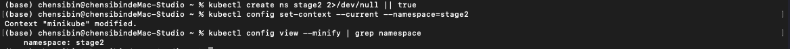

------

## 2.2 Step 1：创建一个 Deployment（2 副本 nginx）

### 跟练：写 YAML 并 apply

```bash
cat > deploy-nginx.yaml <<'EOF'
apiVersion: apps/v1
kind: Deployment
metadata:
  name: nginx-deploy
spec:
  replicas: 2
  selector:
    matchLabels:
      app: nginx
  template:
    metadata:
      labels:
        app: nginx
    spec:
      containers:
        - name: nginx
          image: nginx:1.27
          ports:
            - containerPort: 80
EOF

kubectl apply -f deploy-nginx.yaml
kubectl get deploy,rs,pods -o wide
```

### 验证点

- `kubectl get deploy`：READY 为 `2/2`
- `kubectl get pods`：两个 Pod 都是 `Running`

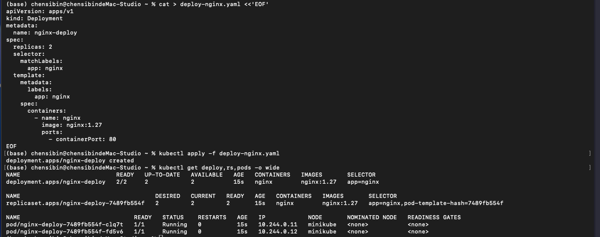

------

## 2.3 目标知识点 2：Service（ClusterIP / NodePort）与访问路径

### 概念解释

- **为什么需要 Service**：Pod IP 会变、Pod 可能有多个副本；Service 给这组 Pod 提供一个**稳定入口**（一个稳定的虚拟 IP + DNS 名）。
- **selector 的作用**：Service 通过 `selector`（匹配 labels）决定“哪些 Pod 是它的后端”；selector 不匹配时，Service 就**没有后端**（endpoints 为空）。
- **ClusterIP vs NodePort**：
  - **ClusterIP**：只在集群内部访问（默认类型）。
  - **NodePort**：在每个节点上开一个端口，适合本地 minikube 快速从宿主机访问。

------

## 2.4 Step 2：创建 NodePort Service 并访问

### 2.4.1 创建 Service

```bash
cat > svc-nginx-nodeport.yaml <<'EOF'
apiVersion: v1
kind: Service
metadata:
  name: nginx-svc
spec:
  type: NodePort
  selector:
    app: nginx
  ports:
    - name: http
      port: 80
      targetPort: 80
      nodePort: 30080
EOF

kubectl apply -f svc-nginx-nodeport.yaml
kubectl get svc -o wide
```

### 2.4.2 获取访问 URL 并 curl

```bash
minikube service nginx-svc --url
curl -I "$(minikube service nginx-svc --url)"
```

### 验证点

- 返回 `HTTP/1.1 200 OK`

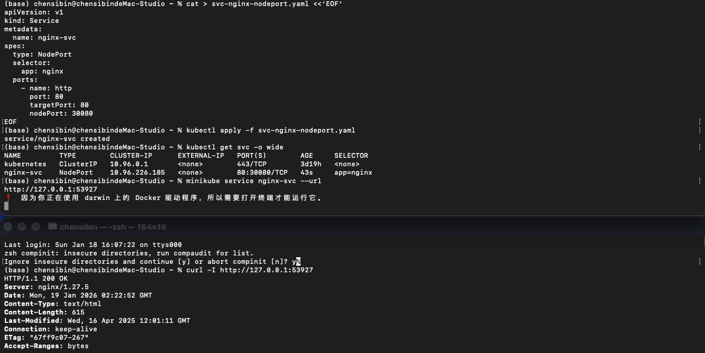

------

## 2.5 目标知识点 3：kubectl 排障“三板斧”

### 概念解释（固定顺序）

1. **get 看状态**：先判断是 `Pending / ImagePullBackOff / CrashLoopBackOff / Running但不Ready` 哪一类。
2. **describe 看 Events**：Events 往往直接给根因（拉镜像失败、探针失败、调度失败、权限/挂载问题）。
3. **logs 看应用错误**：当 Pod 能启动但又退出（CrashLoop）时，logs 是最关键证据。
4. **固定心法**：`get → describe(events) → logs`，80% 的问题都能定位到。

### 跟练：对 nginx Pod 走一遍三板斧（即便它正常）

```bash
kubectl get pods -o wide
kubectl describe pod -l app=nginx | tail -n 40
kubectl logs -l app=nginx --tail=30
```

### 验证点

- describe 的 Events 无持续 Warning
- logs 正常输出（或为空也可）

------

## 2.6 目标知识点 4：滚动更新（rollout）与回滚（undo）

### 概念解释

- Deployment 默认滚动更新：逐步替换 Pod
- `kubectl rollout status`：看 **Deployment 这次发布/滚动更新** 进行到哪了，是否已经成功完成；卡住通常说明新 Pod 没 Ready。
- `kubectl rollout history`：看 **Deployment 的发布历史（revision）**，每次变更对应一个版本号，方便追溯你发布过哪些版本。
- `kubectl rollout undo`：把 Deployment **回滚** 到上一版或指定 revision，然后它会触发一次新的滚动更新来恢复到那个版本。
- **为什么 status 很关键**：Pod 可能 `Running` 但不 `Ready`（readiness 失败），这时发布不算成功，status 会卡住。

------

## 2.7 Step 3：模拟一次发布 + 回滚

### 3.1 滚动更新到 1.28

```bash
kubectl set image deploy/nginx-deploy nginx=nginx:1.28
kubectl rollout status deploy/nginx-deploy
kubectl get pods -o wide
```

### 3.2 查看历史

```bash
kubectl rollout history deploy/nginx-deploy
```

### 3.3 回滚到上一版

```bash
kubectl rollout undo deploy/nginx-deploy
kubectl rollout status deploy/nginx-deploy
```

### 验证点

- 更新与回滚都能顺利完成
- Pod 在更新过程会“新旧交替”

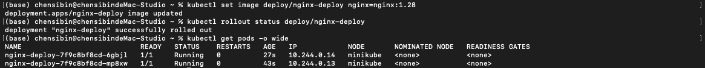

------

## 2.8 目标知识点 5：ConfigMap（配置注入）——把首页内容改掉

### 概念解释

**ConfigMap 是什么**：存放**非敏感**配置（字符串/配置文件片段）。它让你不用重新打镜像，就能更新配置。

**两种常见用法**：

- 作为**环境变量**注入（适合简单 key-value）。
- 作为**文件挂载**注入（适合整段配置/模板文件，比如你这里的 `index.html`）。

**怎么判断生效**：Pod 重建后访问页面变更，或进入容器看挂载路径的文件内容。

------

## 2.9 Step 4：ConfigMap 挂载 index.html（最直观）

### 4.1 创建 ConfigMap

```bash
cat > cm-index.yaml <<'EOF'
apiVersion: v1
kind: ConfigMap
metadata:
  name: nginx-index
data:
  index.html: |
    <html>
      <body>
        <h1>Hello Stage 2</h1>
        <p>ConfigMap mounted file works.</p>
      </body>
    </html>
EOF

kubectl apply -f cm-index.yaml
```

### 4.2 修改 Deployment：挂载 index.html

```bash
cat > deploy-nginx-with-cm.yaml <<'EOF'
apiVersion: apps/v1
kind: Deployment
metadata:
  name: nginx-deploy
spec:
  replicas: 2
  selector:
    matchLabels:
      app: nginx
  template:
    metadata:
      labels:
        app: nginx
    spec:
      containers:
        - name: nginx
          image: nginx:1.27
          ports:
            - containerPort: 80
          volumeMounts:
            - name: webroot
              mountPath: /usr/share/nginx/html/index.html
              subPath: index.html
      volumes:
        - name: webroot
          configMap:
            name: nginx-index
EOF

kubectl apply -f deploy-nginx-with-cm.yaml
kubectl rollout status deploy/nginx-deploy
```

### 4.3 访问验证

```bash
curl "$(minikube service nginx-svc --url)" | head
```

### 验证点

- 输出包含 `Hello Stage 2`

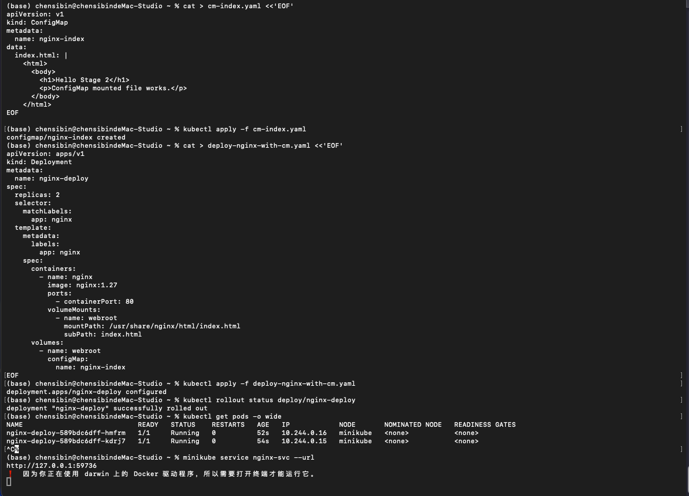

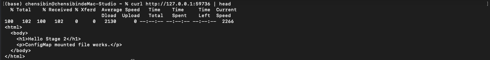

------

# 阶段 2 必做排障 Case（可复现 + 可修复）

## Case A：ImagePullBackOff（镜像拉取失败）

### 现象制造（写一个不存在的 tag）

```bash
kubectl set image deploy/nginx-deploy nginx=nginx:9.99
kubectl get pods -w
```

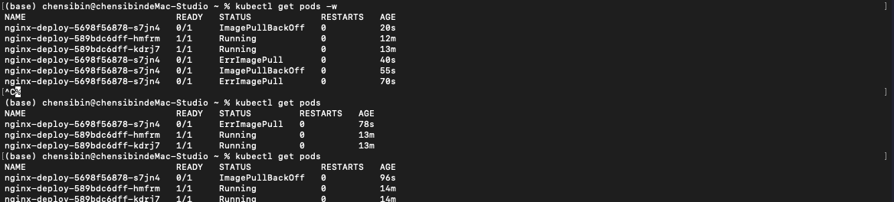

### 排查（三板斧）

```bash
kubectl get pods
kubectl describe pod -l app=nginx | tail -n 50
```

### 修复（改回正确镜像）

```bash
kubectl set image deploy/nginx-deploy nginx=nginx:1.27
kubectl rollout status deploy/nginx-deploy
```

### 验证点

- Pod 恢复 Running
- Events 不再持续 Failed/BackOff

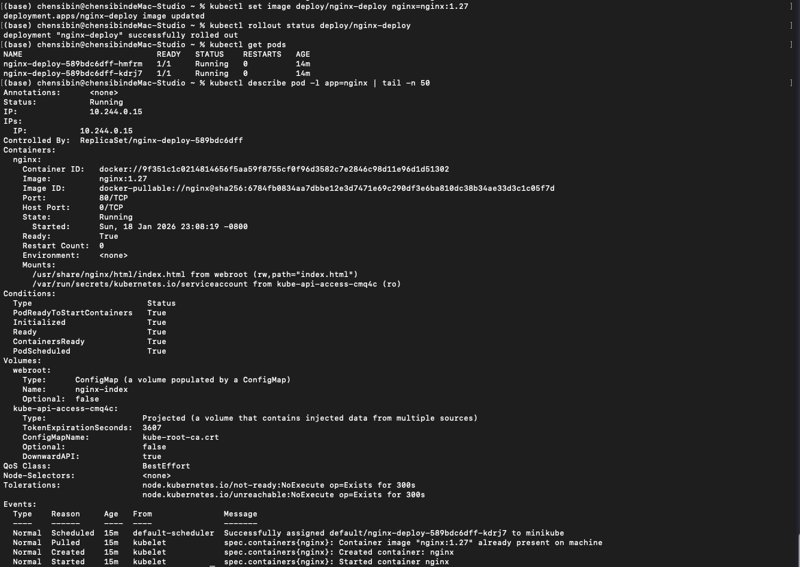

------

## Case B：CrashLoopBackOff（容器反复崩溃）

### 现象制造（容器 1 秒后退出）

```bash
cat > deploy-crash.yaml <<'EOF'
apiVersion: apps/v1
kind: Deployment
metadata:
  name: crash-demo
spec:
  replicas: 1
  selector:
    matchLabels:
      app: crash
  template:
    metadata:
      labels:
        app: crash
    spec:
      containers:
        - name: crash
          image: alpine:3.20
          command: ["sh","-c","echo start; sleep 1; exit 1"]
EOF

kubectl apply -f deploy-crash.yaml
kubectl get pods -l app=crash -w
```

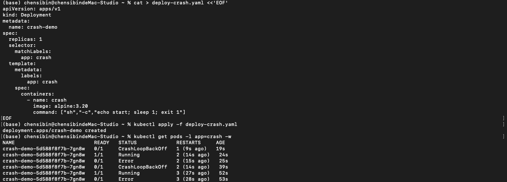

### 排查

```bash
kubectl describe pod -l app=crash | tail -n 50
kubectl logs -l app=crash --tail=50
```

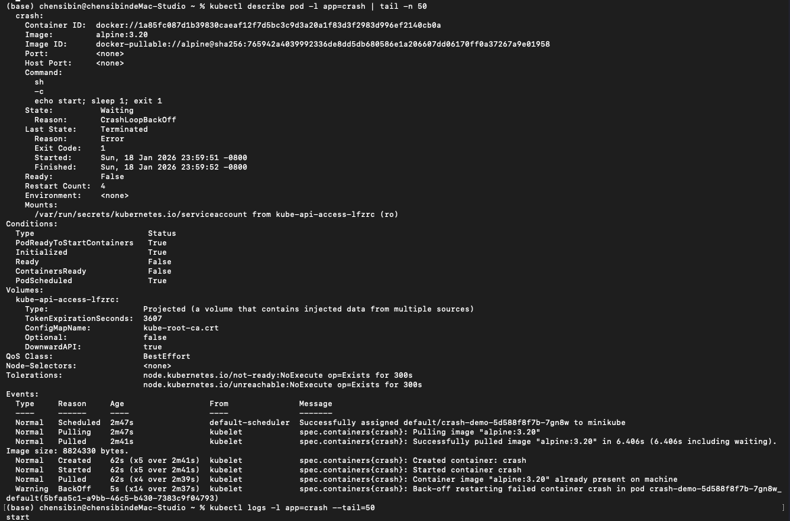

### 修复（改成长期运行）

```bash
kubectl patch deploy crash-demo --type='json' -p='[
  {"op":"replace","path":"/spec/template/spec/containers/0/command","value":["sh","-c","echo ok; sleep 3600"]}
]'

kubectl rollout status deploy/crash-demo
```

### 验证点

- Pod 变为 Running
- 不再反复重启

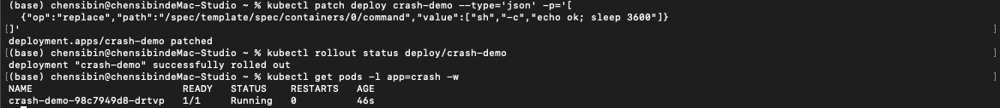

------

## Case C：Readiness probe failed（Running 但不接流量）

### 概念解释

**readinessProbe 失败：容器可能还在跑（Running），但 Kubernetes 认为“还不能接流量”，所以**不会把它加入 Service endpoints**。

**这会导致什么现象**：你访问 Service 可能超时/无后端，即使 Pod 看起来是 Running。

**对比 livenessProbe**：liveness 失败会触发重启；readiness 失败不会重启，只是“不接流量”。

### 现象制造（探测一个不存在的路径）

```bash
cat > deploy-readiness-bad.yaml <<'EOF'
apiVersion: apps/v1
kind: Deployment
metadata:
  name: ready-demo
spec:
  replicas: 1
  selector:
    matchLabels:
      app: ready
  template:
    metadata:
      labels:
        app: ready
    spec:
      containers:
        - name: nginx
          image: nginx:1.27
          ports:
            - containerPort: 80
          readinessProbe:
            httpGet:
              path: /not-exist
              port: 80
            initialDelaySeconds: 2
            periodSeconds: 3
EOF

kubectl apply -f deploy-readiness-bad.yaml
kubectl get pods -l app=ready -w
```

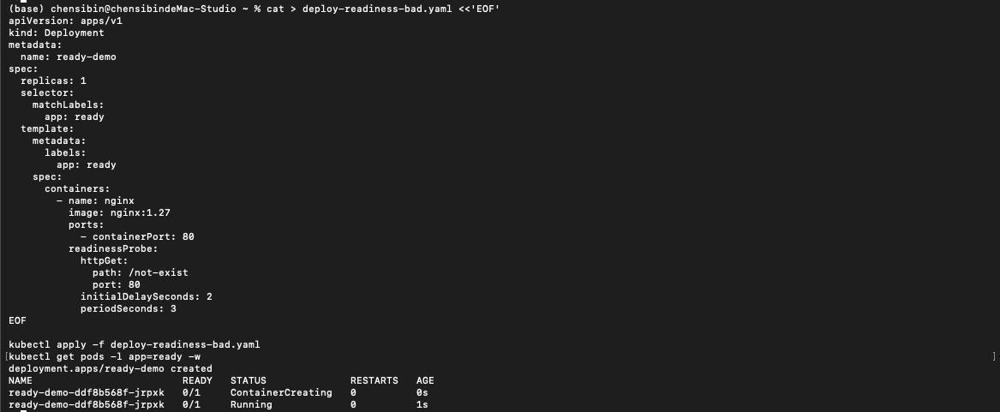

### 排查（重点看 endpoints）

```bash
kubectl describe pod -l app=ready | tail -n 50
kubectl get endpointslices -o wide
```

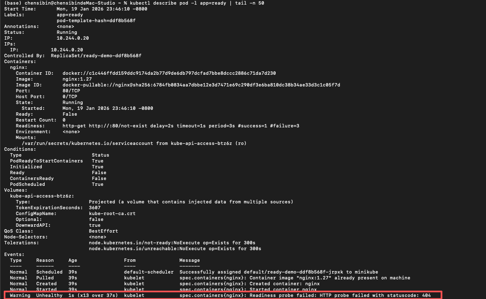

### 修复（路径改成 `/`）

```bash
kubectl patch deploy ready-demo --type='json' -p='[
  {"op":"replace","path":"/spec/template/spec/containers/0/readinessProbe/httpGet/path","value":"/"}
]'
kubectl rollout status deploy/ready-demo

cat > svc-ready.yaml <<'EOF'
apiVersion: v1
kind: Service
metadata:
  name: ready-svc
spec:
  type: ClusterIP
  selector:
    app: ready
  ports:
    - port: 80
      targetPort: 80
EOF

kubectl apply -f svc-ready.yaml
kubectl get svc ready-svc

kubectl get endpointslices -l kubernetes.io/service-name=ready-svc -o wide
kubectl describe endpointslice -l kubernetes.io/service-name=ready-svc | grep -n "10.244.0.21" || echo "NOT FOUND"
kubectl get pod -l app=ready -o wide
kubectl get svc ready-svc -o jsonpath='{.spec.selector}{"\n"}'

kubectl port-forward svc/ready-svc 8081:80
curl -I http://localhost:8081
```

### 验证点

- readiness 变为 Ready
- endpoints 出现对应 Pod IP
- 通过port-forward 的方式本地验证 ping 通

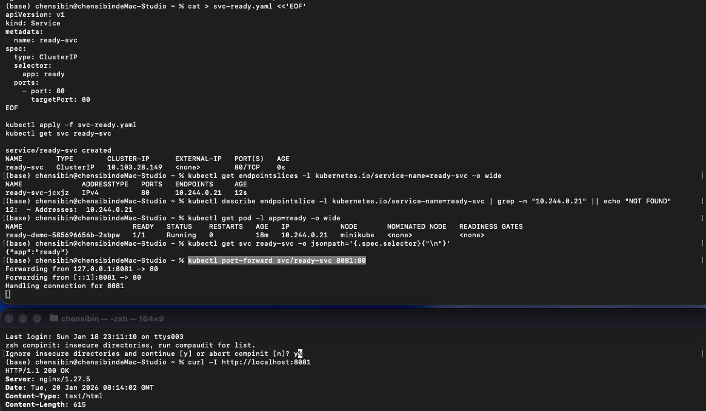

------

## 2.10 阶段 2 清理（建议执行）

```bash
kubectl delete deploy nginx-deploy crash-demo ready-demo --ignore-not-found
kubectl delete svc nginx-svc ready-svc --ignore-not-found
kubectl delete cm nginx-index --ignore-not-found
```

------

## 阶段 2 结束验收（5 分钟快速自检）

执行下面命令，你应看到所有对象状态正常（或已清理干净）：

```bash
kubectl get deploy
kubectl get pods
kubectl get svc
kubectl get cm
```

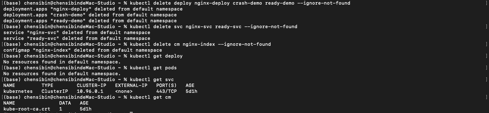