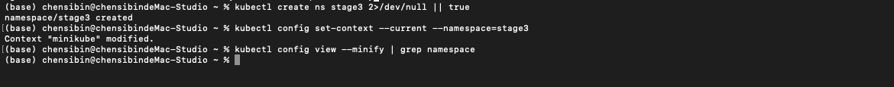
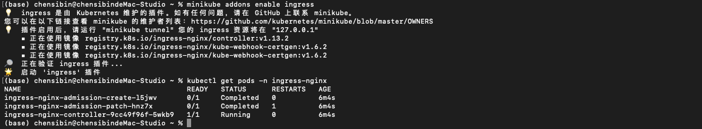
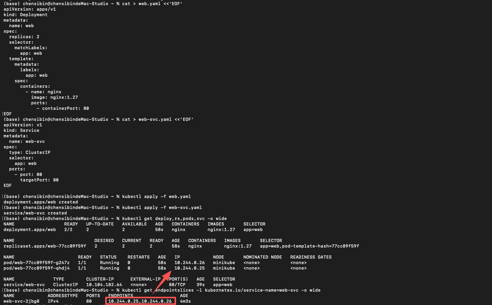

# 阶段 3：Ingress + Secret + 资源限制/扩缩容 + 常见网络排障（minikube + DaoCloud）

## 3.0 阶段目标与验收标准

### ✅ 完成阶段 3 应该能做到

-  能把一个 Web 服务通过 **Ingress** 暴露出来（Host/Path 路由）
-  理解 **Ingress Controller vs Ingress** 的区别，并会排查 404/503
-  会用 **Secret**（env / volume）注入敏感配置，并知道它和 ConfigMap 的边界
-  会设置 **requests/limits**，理解它们对调度/性能/稳定性的影响
-  会启用 metrics-server，并用 **HPA** 自动扩缩容
-  能用一套固定“网络排障路径”定位：
  - selector 不匹配 → 没有后端
  - readiness 失败 → 后端不 Ready
  - Ingress host/path 不匹配 → 404
  - 后端不可达 → 503 / timeout
  - DNS 解析问题

------

## 3.1 环境准备（独立 namespace）

### 概念解释

- 独立 namespace 方便反复练习、清理；所有对象在这个空间内闭环。

### 跟练

```bash
kubectl create ns stage3 2>/dev/null || true
kubectl config set-context --current --namespace=stage3
kubectl config view --minify | grep namespace
```

### 验证点

看到 `namespace: stage3`



------

## 3.2 模块 1：Ingress（“入口规则”）与 Ingress Controller（“执行入口规则的人”）

### 概念解释

- **Ingress**：一组“HTTP 路由规则”（Host/Path → Service）。它本身不转发流量。
- **Ingress Controller**：真正监听端口、执行转发的组件（例如 ingress-nginx）。没有 Controller，Ingress 只是“配置文件”。
- 常见现象对照：
  - **404**：请求到达 Controller，但 **Host/Path 没匹配到任何规则**
  - **503**：规则匹配了，但 **后端 Service 没有可用 endpoints（EndpointSlice 为空或后端 notReady）**

------

## 3.3 Step 1：启用 Ingress Controller（minikube）

> minikube 最省事方式：启用内置 addon。

```bash
minikube addons enable ingress
kubectl get pods -n ingress-nginx
```

### 验证点

- `ingress-nginx` 命名空间下有 `controller` Pod，状态 `Running`



------

## 3.4 Step 2：部署一个后端服务（Deployment + Service）

### 概念解释

- Ingress 只能转发到 **Service**，不能直接转发到 Pod。
- 所以最小闭环：Deployment（跑 Pod）→ Service（稳定后端入口）→ Ingress（对外路由）

### 跟练：创建 nginx + ClusterIP Service

```bash
cat > web.yaml <<'EOF'
apiVersion: apps/v1
kind: Deployment
metadata:
  name: web
spec:
  replicas: 2
  selector:
    matchLabels:
      app: web
  template:
    metadata:
      labels:
        app: web
    spec:
      containers:
        - name: nginx
          image: nginx:1.27
          ports:
            - containerPort: 80
EOF

cat > web-svc.yaml <<'EOF'
apiVersion: v1
kind: Service
metadata:
  name: web-svc
spec:
  type: ClusterIP
  selector:
    app: web
  ports:
    - port: 80
      targetPort: 80
EOF

kubectl apply -f web.yaml
kubectl apply -f web-svc.yaml
kubectl get deploy,pods,svc -o wide
```

### 验证点（用 EndpointSlice 新命令）

```bash
kubectl get endpointslices -l kubernetes.io/service-name=web-svc -o wide
```

能看到后端 Pod IP 即表示 Service 已“接上后端”。



------

## 3.5 Step 3：创建 Ingress（Host 路由）

### 概念解释

- Ingress 用 Host/Path 做路由；本地练习时不一定要改 `/etc/hosts`，用 `curl -H "Host: ..."` 更稳。
- 对 minikube：直接请求 `http://$(minikube ip)`，加 Host 头来命中规则。

### 跟练：创建 Ingress

```bash
cat > ing-web.yaml <<'EOF'
apiVersion: networking.k8s.io/v1
kind: Ingress
metadata:
  name: web-ing
spec:
  rules:
    - host: web.local
      http:
        paths:
          - path: /
            pathType: Prefix
            backend:
              service:
                name: web-svc
                port:
                  number: 80
EOF

kubectl apply -f ing-web.yaml
kubectl get ingress
```

访问验证（不改 hosts，直接带 Host 头）：

```
MINI_IP=$(minikube ip)
curl -I -H "Host: web.local" "http://${MINI_IP}/"
```

### 验证点

- 返回 `HTTP/1.1 200 OK`（或 `HTTP/2 200` 也可）

------

## 3.6 模块 2：Secret（敏感配置注入）

### 概念解释

- **Secret**：用于敏感信息（token/password/cert）。
- 与 ConfigMap 的区别：用途是敏感数据；**不要把密码明文写进 YAML**（真实项目一般用外部密管/CI 注入）。
- 两种注入方式：
  - **env**：应用通过环境变量读取
  - **volume**：以文件形式挂载（证书/私钥常用）

------

## 3.7 Step 4：创建 Secret，并以 env + volume 两种方式注入

### 4.1 创建 Secret（命令方式更安全：不在文件里写明文）

```
kubectl create secret generic app-secret \
  --from-literal=API_KEY="my-key-123" \
  --from-literal=DB_PWD="p@ssw0rd"
```

查看（注意这里只展示 metadata，不会直接给你明文）：

```
kubectl describe secret app-secret
```

### 4.2 注入到一个演示 Pod：env + volume

```
cat > secret-demo.yaml <<'EOF'
apiVersion: v1
kind: Pod
metadata:
  name: secret-demo
  labels:
    app: secret-demo
spec:
  containers:
    - name: alpine
      image: alpine:3.20
      command: ["sh","-c","echo API_KEY=$API_KEY; ls -l /secrets; echo '---'; cat /secrets/DB_PWD; sleep 3600"]
      env:
        - name: API_KEY
          valueFrom:
            secretKeyRef:
              name: app-secret
              key: API_KEY
      volumeMounts:
        - name: secrets
          mountPath: /secrets
          readOnly: true
  volumes:
    - name: secrets
      secret:
        secretName: app-secret
EOF

kubectl apply -f secret-demo.yaml
kubectl logs secret-demo --tail=50
```

### 验证点

- logs 里能看到 `API_KEY=...`
- `/secrets/DB_PWD` 能被读取（以文件形式注入成功）

------

## 3.8 模块 3：资源 requests/limits（调度依据 + 运行上限）

### 概念解释

- **requests**：调度时“我至少需要多少资源”；Scheduler 用它决定 Pod 放到哪个节点（保证能分到）。
- **limits**：运行时“我最多能用多少资源”；超过会被限制或杀掉（内存常见 `OOMKilled`）。
- 记忆法：`requests` 影响“能不能被安排”；`limits` 影响“跑起来会不会被掐”。

------

## 3.9 Step 5：给 nginx 加 requests/limits，并观察效果

```
cat > web-res.yaml <<'EOF'
apiVersion: apps/v1
kind: Deployment
metadata:
  name: web
spec:
  replicas: 2
  selector:
    matchLabels:
      app: web
  template:
    metadata:
      labels:
        app: web
    spec:
      containers:
        - name: nginx
          image: nginx:1.27
          ports:
            - containerPort: 80
          resources:
            requests:
              cpu: "50m"
              memory: "64Mi"
            limits:
              cpu: "200m"
              memory: "128Mi"
EOF

kubectl apply -f web-res.yaml
kubectl rollout status deploy/web
kubectl describe pod -l app=web | sed -n '/Requests:/,/Conditions:/p'
```

### 验证点

- describe 中能看到 requests/limits 已生效

> 额外提示：想“看到实时 CPU/内存”，需要 metrics-server（下一模块会启用）。

------

## 3.10 模块 4：HPA 自动扩缩容（依赖 metrics-server）

### 概念解释

- **HPA**：根据指标（最常见 CPU）自动调整 Deployment 副本数。
- 前提：集群里要能拿到指标（minikube 通常用 `metrics-server`）。
- 必要条件：Pod 要有 **cpu requests**（否则 HPA 无法计算使用率百分比）。

------

## 3.11 Step 6：启用 metrics-server，并创建 HPA

### 6.1 启用 metrics-server

```
minikube addons enable metrics-server
kubectl get pods -n kube-system | grep metrics
```

验证指标可用：

```
kubectl top nodes
kubectl top pods
```

### 6.2 创建 HPA（目标 CPU 50%，1~5 副本）

```
kubectl autoscale deployment web --cpu-percent=50 --min=1 --max=5
kubectl get hpa
```

### 6.3 造压触发扩容（用 busybox 发请求）

```
kubectl run load --image=busybox:1.36 --restart=Never -it --rm -- \
  sh -c 'while true; do wget -q -O- http://web-svc >/dev/null; done'
```

另开终端观察：

```
kubectl get hpa -w
```

### 验证点

- `kubectl get hpa` 中 `TARGETS` 会变化
- `kubectl get deploy web` 副本数会从 2 逐步上升（到 max 为止）

停止压测：退出 load（Ctrl+C 会结束）

------

# 3.12 常见网络排障（固定路径 + 3 个必练 Case）

## 排障固定路径（强烈建议背下来）

### A）Ingress 不通（先看规则/再看后端）

1. `kubectl get ingress`（有没有创建成功）
2. `kubectl describe ingress <name>`（Host/Path 配没配对）
3. `kubectl get pods -n ingress-nginx`（controller 是否 Running）
4. 后端检查（Service/EndpointSlice/Readiness）

### B）Service 不通（80% 是 selector/endpointslice）

1. `kubectl get svc <svc>`（端口、selector）
2. `kubectl get endpointslices -l kubernetes.io/service-name=<svc>`（有没有后端）
3. `kubectl get pods -l <label> -o wide`（Pod 是否 Ready）

### C）Pod 内部网络/DNS

- `kubectl exec` 进 Pod 测连通：`wget/curl/nslookup`
- 失败再看 CoreDNS：`kubectl get pods -n kube-system | grep coredns`

------

## Case 1：Ingress 404（Host/Path 不匹配）

### 复现：用错 Host

```
MINI_IP=$(minikube ip)
curl -I -H "Host: wrong.local" "http://${MINI_IP}/"
```

### 定位

```
kubectl describe ingress web-ing | sed -n '1,120p'
```

### 修复/验证

```
curl -I -H "Host: web.local" "http://${MINI_IP}/"
```

------

## Case 2：Ingress 503（后端没有可用 EndpointSlice）

### 复现：把 Service selector 改错（让它选不到 Pod）

```
kubectl patch svc web-svc -p '{"spec":{"selector":{"app":"web-wrong"}}}'
```

### 现象验证（EndpointSlice 为空或无可用 endpoint）

```
kubectl get endpointslices -l kubernetes.io/service-name=web-svc -o wide
curl -I -H "Host: web.local" "http://$(minikube ip)/"
```

### 定位

```
kubectl get svc web-svc -o jsonpath='{.spec.selector}{"\n"}'
kubectl get pods -l app=web --show-labels
```

### 修复：把 selector 改回正确

```
kubectl patch svc web-svc -p '{"spec":{"selector":{"app":"web"}}}'
kubectl get endpointslices -l kubernetes.io/service-name=web-svc -o wide
```

------

## Case 3：DNS 问题（Pod 内解析失败）

### 跟练：进入一个临时 Pod 测 DNS

```
kubectl run dns-test --image=busybox:1.36 --restart=Never -it --rm -- sh
```

在交互里执行：

```
nslookup web-svc
nslookup kubernetes.default.svc.cluster.local
wget -qO- http://web-svc >/dev/null && echo OK
exit
```

如果解析失败，检查 CoreDNS：

```
kubectl get pods -n kube-system | grep coredns
kubectl logs -n kube-system -l k8s-app=kube-dns --tail=80
```

------

## 3.13 阶段 3 清理（建议）

```
kubectl delete ingress web-ing --ignore-not-found
kubectl delete svc web-svc --ignore-not-found
kubectl delete deploy web --ignore-not-found
kubectl delete hpa web --ignore-not-found
kubectl delete pod secret-demo --ignore-not-found
kubectl delete secret app-secret --ignore-not-found
```

------

## 3.14 阶段 3 最终验收（5 分钟自检）

你能独立完成并解释：

1. Ingress：`curl -H Host:web.local http://$(minikube ip)` 返回 200
2. Secret：env + 文件挂载都能读到值
3. requests/limits：describe 能看到生效
4. HPA：能看到 HPA 指标变化并触发副本变化
5. 排障：能用 EndpointSlice 找到“有没有后端、后端是否 Ready”的答案